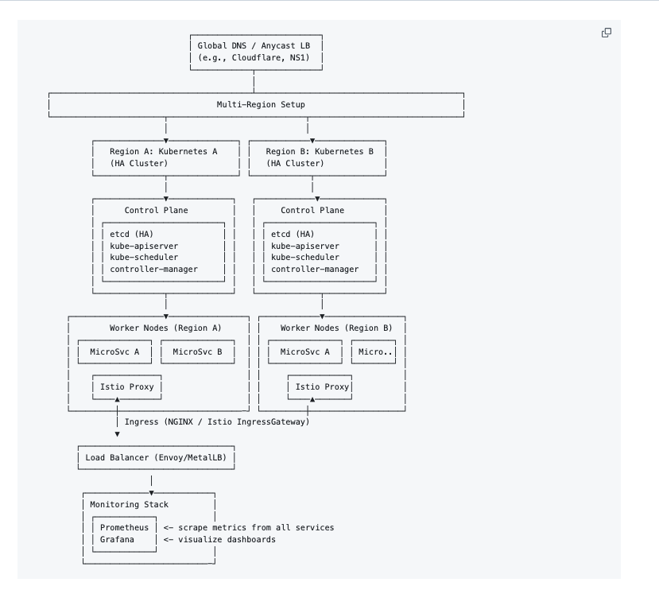

# Cloud-Agnostic Container Orchestration Architecture

Below is a comprehensive design for a cloud-agnostic container orchestration system that meets your requirements for microservices deployment, load balancing, network security, and multi-region failover.

## Core Components

### 1. Orchestration Layer
- **Kubernetes (K8s)**: The de facto standard for container orchestration, supported across all major cloud providers
- **Cluster Federation**: For multi-region deployment and failover

### 2. Networking
- **Service Mesh**: Istio or Linkerd for advanced traffic management and service-to-service communication
- **Cloud-Neutral VPC Implementation**:
  - Calico for network policy enforcement
  - Cilium for API-aware network security
  - Submariner for cross-cluster connectivity

### 3. Load Balancing
- **Ingress Controller**: Nginx, Traefik, or HAProxy
- **Global Server Load Balancer**: 
  - Cloudflare, Akamai, or similar for DNS-based global traffic routing
  - Keepalived for active-passive failover

## Architecture Diagram

```
┌───────────────────────────────────────────────────────────────────────────────┐
│                              Global Load Balancer                             │
│                            (Cloudflare/Akamai/etc.)                           │
└───────────────┬───────────────────────┬───────────────────────┬───────────────┘
                │                       │                       │
┌───────────────▼───────┐   ┌──────────▼──────────┐   ┌────────▼───────────────┐
│      Region A         │   │      Region B       │   │      Region C         │
│ ┌───────────────────┐ │   │ ┌─────────────────┐ │   │ ┌───────────────────┐ │
│ │  VPC (Calico/Cil) │ │   │ │ VPC (Calico/Cil)│ │   │ │ VPC (Calico/Cil)  │ │
│ │ ┌───────────────┐ │ │   │ │ ┌─────────────┐ │ │   │ │ ┌───────────────┐ │ │
│ │ │  K8s Cluster  │ │ │   │ │ │ K8s Cluster │ │ │   │ │ │ K8s Cluster   │ │ │
│ │ │ ┌───────────┐ │ │ │   │ │ │ ┌─────────┐ │ │ │   │ │ │ ┌───────────┐ │ │ │
│ │ │ │ Ingress   │ │ │ │   │ │ │ │ Ingress │ │ │ │   │ │ │ │ Ingress   │ │ │ │
│ │ │ │ Controller│ │ │ │   │ │ │ │Controller││ │ │   │ │ │ │ Controller│ │ │ │
│ │ │ └─────┬─────┘ │ │ │   │ │ │ └────┬────┘ │ │ │   │ │ │ └─────┬─────┘ │ │ │
│ │ │ ┌─────▼─────┐ │ │ │   │ │ │ ┌────▼────┐ │ │ │   │ │ │ ┌─────▼─────┐ │ │ │
│ │ │ │ Service   │ │ │ │   │ │ │ │ Service │ │ │ │   │ │ │ │ Service   │ │ │ │
│ │ │ │ Mesh      │ │ │ │   │ │ │ │ Mesh    │ │ │ │   │ │ │ │ Mesh      │ │ │ │
│ │ │ └─────┬─────┘ │ │ │   │ │ │ └────┬────┘ │ │ │   │ │ │ └─────┬─────┘ │ │ │
│ │ │ ┌─────▼─────┐ │ │ │   │ │ │ ┌────▼────┐ │ │ │   │ │ │ ┌─────▼─────┐ │ │ │
│ │ │ │Microservice│ │ │ │   │ │ │ │Microsvc │ │ │ │  │ │ │ │Micro.     │ │ │ │
│ │ │ │  A         │ │ │ │   │ │ │ │ B       │ │ │ │  │ │ │ │ C         │ │ │ │
│ │ │ └───────────┘ │ │ │   │ │ │ └─────────┘ │ │ │   │ │ │ └───────────┘ │ │ │
│ │ └───────────────┘ │ │   │ │ └─────────────┘ │ │   │ │ └───────────────┘ │ │
│ └───────────────────┘ │   │ └─────────────────┘ │   │ └───────────────────┘ │
└───────────────────────┘   └─────────────────────┘   └───────────────────────┘
```

With Controle Plan and which is aligned with Kubernetes.


## Implementation Details

### 1. Cloud-Agnostic Kubernetes Deployment

**Options:**
- **Managed K8s Services**: EKS (AWS), GKE (GCP), AKS (Azure) with consistent configuration
- **Self-Managed**: Using kubeadm, kops, or kubespray on VMs across clouds
- **Abstracted Platforms**: Openshift, Rancher, or Tanzu for consistent management

**Configuration Management:**
```yaml
# Example k8s deployment (cloud-agnostic)
apiVersion: apps/v1
kind: Deployment
metadata:
  name: microservice-a
spec:
  replicas: 3
  selector:
    matchLabels:
      app: microservice-a
  template:
    metadata:
      labels:
        app: microservice-a
    spec:
      containers:
      - name: microservice-a
        image: your-registry/microservice-a:latest
        ports:
        - containerPort: 8080
```

### 2. Network Security (VPC Equivalent)

**Implementation:**
- **Network Policies** (cloud-agnostic alternative to VPC rules):
```yaml
apiVersion: networking.k8s.io/v1
kind: NetworkPolicy
metadata:
  name: microservice-a-egress
spec:
  podSelector:
    matchLabels:
      app: microservice-a
  policyTypes:
  - Egress
  egress:
  - to:
    - podSelector:
        matchLabels:
          app: microservice-b
    ports:
    - protocol: TCP
      port: 8080
```

- **Service Mesh Policies** (Istio example):
```yaml
apiVersion: security.istio.io/v1beta1
kind: AuthorizationPolicy
metadata:
  name: microservice-a-auth
spec:
  selector:
    matchLabels:
      app: microservice-a
  rules:
  - from:
    - source:
        principals: ["cluster.local/ns/default/sa/microservice-b"]
    to:
    - operation:
        methods: ["GET", "POST"]
```

### 3. Load Balancing Implementation

**Ingress Controller Configuration:**
```yaml
apiVersion: networking.k8s.io/v1
kind: Ingress
metadata:
  name: microservice-ingress
  annotations:
    nginx.ingress.kubernetes.io/rewrite-target: /
spec:
  ingressClassName: nginx
  rules:
  - host: api.yourdomain.com
    http:
      paths:
      - path: /service-a
        pathType: Prefix
        backend:
          service:
            name: microservice-a
            port:
              number: 8080
```

### 4. Multi-Region Failover Strategy

**Implementation Components:**
1. **Cluster Federation**: 
   - Kubefed for synchronizing resources across clusters
   - Custom resource distribution policies

2. **DNS-Based Failover**:
   - Low TTL DNS records (30-60 seconds)
   - Health checks triggering DNS updates

3. **Data Replication**:
   - Database: CockroachDB, Yugabyte, or Cassandra for multi-region
   - Object Storage: Rclone or MinIO bucket replication

4. **Failover Automation**:
   - Prometheus + Alertmanager for monitoring
   - Custom operators for automatic failover triggers

## Deployment Pipeline

```
1. Code Commit → 2. CI Build → 3. Container Build → 4. Security Scan → 5. Registry Push
     ↓
6. Helm Chart Update → 7. ArgoCD Sync → 8. Canary Deployment → 9. Full Rollout
     ↓
10. Multi-Region Sync (via Cluster Federation)
```

## Monitoring and Observability

- **Centralized Logging**: Loki or ELK stack
- **Metrics**: Prometheus with Thanos for multi-cluster
- **Tracing**: Jaeger or Zipkin
- **Dashboard**: Grafana with multi-cluster data sources

## Security Considerations

1. **Pod Security**:
   - PodSecurity admission controller
   - Non-root containers
   - Read-only root filesystems where possible

2. **Secret Management**:
   - External secrets operator (AWS Secrets Manager, HashiCorp Vault)
   - SealedSecrets for git-ops workflows

3. **Runtime Security**:
   - Falco for runtime threat detection
   - Image vulnerability scanning in CI/CD

## Cost Optimization Strategies

1. **Cluster Autoscaler**: Scale nodes based on demand
2. **Horizontal Pod Autoscaler**: Scale microservices based on metrics
3. **Spot Instances**: For fault-tolerant workloads
4. **Service Mesh Smart Routing**: Failover to cheapest region during non-peak

This architecture provides a robust, cloud-agnostic solution that meets all your requirements while maintaining flexibility across different cloud providers and on-premises environments.